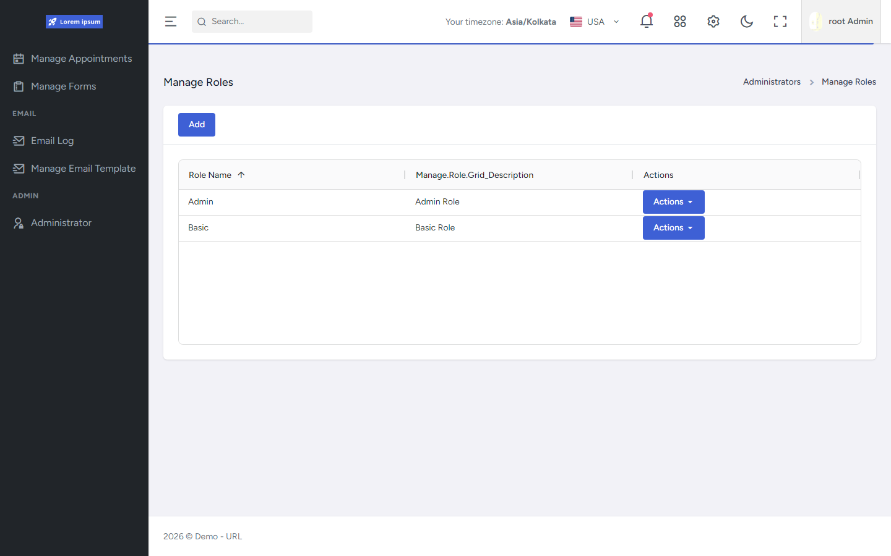
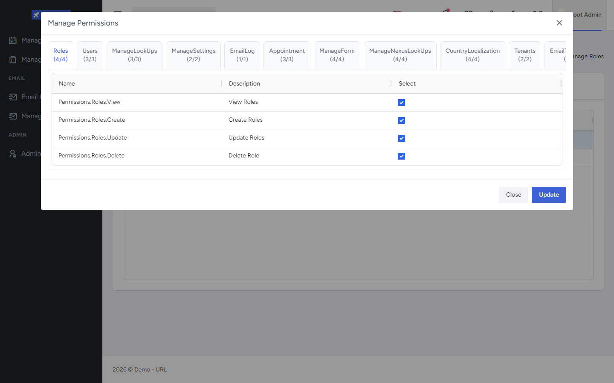

# API Authorization

Authorization is permission-based and policy-driven. Controllers declare required permissions; ASP.NET Core resolves policies dynamically and checks the caller's role-claim permissions (cached per user, tenant-scoped).

Related: [Authentication](../Authentication/README.md) · [Multi-Tenancy](../MultiTenancy/README.md) · [Security](../Security/README.md)

Diagram: [Authorization policy resolution](../../assets/diagrams/authorization-policy-resolution/README.md)

## Verified capabilities

- Central permission catalog: actions × resources with Root/Admin/Basic assignment flags.
- Permission policy names follow `Permissions.{resource}.{action}`.
- `MustHavePermission` attribute maps action/resource to a policy name.
- Composite helpers allow OR/AND combinations across actions/resources.
- Dynamic `IAuthorizationPolicyProvider` builds `PermissionRequirement` policies for permission-prefixed names.
- `PermissionAuthorizationHandler` calls `IUserService.HasPermissionAsync` and logs permission denials.
- Permissions are loaded from role claims in Nexus DB — **not** from JWT role claims.
- Permission lists are cached with tenant-prefixed cache keys; role permission updates invalidate caches.
- Roles are tenant-scoped (physical role names prefixed by tenant id; friendly names for UI).
- Default roles and Admin permission-edit restrictions are enforced in role services.
- Controllers are globally authorized at map time; anonymous is opt-in.

## Authorization request flow

```text
Controller attribute (MustHavePermission / RequireAny* / RequireAll*)
  → Policy name (Permissions.{resource}.{action} or OR/AND joined names)
    → PermissionPolicyProvider → PermissionRequirement
      → Authentication (JWT + session validation)
        → CurrentUserMiddleware
          → Authorization middleware
            → PermissionAuthorizationHandler
              → HasPermissionAsync(userId, policyName)
                → cached role permission claim values
                → evaluate exact / OR / AND
              → Succeed | log PermissionDenied
```

## Permission model (public-facing)

| Concept | Behavior |
|---------|----------|
| Actions | View, Create, Update, Delete, Export |
| Resources | Users, Roles, lookups, settings, email, appointments, forms, tenants, localization, subscriptions, Nexus resources, etc. |
| Catalog flags | Permissions can be marked for Root / Admin / Basic role seeding |
| Storage | Permission values stored as role claims of the permission claim type |

Exact claim-type constant strings are intentionally not reproduced here; see Shared authorization sources for the canonical definitions.

## Tenant-scoped roles

- Role queries and mutations filter to the current tenant.
- Stored Identity role `Name` is tenant-prefixed; `UserFriendlyRoleName` is the display name.
- Updating role permissions refreshes permission caches for the tenant.

## UI evidence

Administrators manage roles and assign permissions in the FrontEnd (backend policies still authorize every request):





See [manage-roles screenshots](../../assets/screenshots/manage-roles/README.md).

## Evidence

- [`API/src/Core/Shared/Authorization/SystemPermissions.cs`](https://github.com/UjjwalSud/clean-architecture-10.0/blob/main/API/src/Core/Shared/Authorization/SystemPermissions.cs)
- [`API/src/Core/Shared/Authorization/SystemRoles.cs`](https://github.com/UjjwalSud/clean-architecture-10.0/blob/main/API/src/Core/Shared/Authorization/SystemRoles.cs)
- [`API/src/Core/Shared/Authorization/SystemClaims.cs`](https://github.com/UjjwalSud/clean-architecture-10.0/blob/main/API/src/Core/Shared/Authorization/SystemClaims.cs)
- [`API/src/Infrastructure/Auth/Permissions/MustHavePermissionAttribute.cs`](https://github.com/UjjwalSud/clean-architecture-10.0/blob/main/API/src/Infrastructure/Auth/Permissions/MustHavePermissionAttribute.cs)
- [`API/src/Infrastructure/Auth/Permissions/PermissionPolicyProvider.cs`](https://github.com/UjjwalSud/clean-architecture-10.0/blob/main/API/src/Infrastructure/Auth/Permissions/PermissionPolicyProvider.cs)
- [`API/src/Infrastructure/Auth/Permissions/PermissionRequirement.cs`](https://github.com/UjjwalSud/clean-architecture-10.0/blob/main/API/src/Infrastructure/Auth/Permissions/PermissionRequirement.cs)
- [`API/src/Infrastructure/Auth/Permissions/PermissionAuthorizationHandler.cs`](https://github.com/UjjwalSud/clean-architecture-10.0/blob/main/API/src/Infrastructure/Auth/Permissions/PermissionAuthorizationHandler.cs)
- [`API/src/Infrastructure/Nexus/Identity/UserService.Permissions.cs`](https://github.com/UjjwalSud/clean-architecture-10.0/blob/main/API/src/Infrastructure/Nexus/Identity/UserService.Permissions.cs)
- [`API/src/Infrastructure/Nexus/Identity/RoleService.cs`](https://github.com/UjjwalSud/clean-architecture-10.0/blob/main/API/src/Infrastructure/Nexus/Identity/RoleService.cs)
- [`API/src/Infrastructure/Nexus/Identity/DbModels/ApplicationRole.cs`](https://github.com/UjjwalSud/clean-architecture-10.0/blob/main/API/src/Infrastructure/Nexus/Identity/DbModels/ApplicationRole.cs)
- [`API/src/Infrastructure/Auth/Startup.cs`](https://github.com/UjjwalSud/clean-architecture-10.0/blob/main/API/src/Infrastructure/Auth/Startup.cs)
- [`API/src/Infrastructure/Startup.cs`](https://github.com/UjjwalSud/clean-architecture-10.0/blob/main/API/src/Infrastructure/Startup.cs) (`MapControllers().RequireAuthorization()`)
