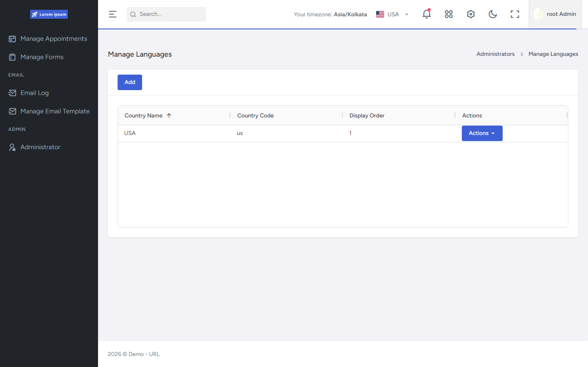

# Localization

Cross-stack localization: Nexus country + key/value string catalog on the API, Orbit admin UI to manage languages/strings, and FrontEnd **i18next** runtime loading.

Related: [FrontEnd Technology & Libraries](../../FrontEnd/Technology-Libraries.md) · [API README](../README.md)

## Verified capabilities

### API / data model

- Entities: `Country`, `CountryLocalization` (key/value) on Nexus DbContext.
- `LocalizationController` — CRUD-style country and localization APIs with `CountryLocalization` permissions.
- Public/runtime helpers on data controllers for countries and country localizations.
- New countries can seed a default English key catalog; refresh fills missing keys.
- Reads used by the SPA commonly **ignore query filters** — catalogs behave as **shared/global** strings, not per-tenant language packs (even though entities inherit auditable/`TenantId` fields).

### FrontEnd

- `i18next` / `react-i18next` bootstrap from the language dropdown module.
- Runtime: fetch countries + strings, `addResourceBundle`, `changeLanguage`.
- Cache helper in `localStorage` (`localizations_{countryId}`) when present.
- Fallback language configured (`us`); many `t(key, 'English default')` call sites supply inline defaults.
- Admin: **Manage Language** / per-country localization editor under Orbit.
- `i18next-http-backend` is listed in dependencies but **not** used by the Orbit runtime path verified in source.

## Maturity (factual)

This is a working admin + runtime localization feature for product UI strings. It is **not** documented here as full multi-tenant translation packs or complete coverage of every UI string.

## Screenshot

See [manage-language screenshot](../../assets/screenshots/manage-language/README.md).

## Evidence

- `API/src/Host/Controllers/Localization/LocalizationController.cs`
- `API/src/Infrastructure/Nexus/Localization/LocalizationService.cs`
- `FrontEnd/src/components/LanguageDropdown/i18n.ts`
- `FrontEnd/src/components/LanguageDropdown/`
- `FrontEnd/src/pages/orbit/manage-language/`
- `FrontEnd/package.json` (`i18next`, `react-i18next`)
