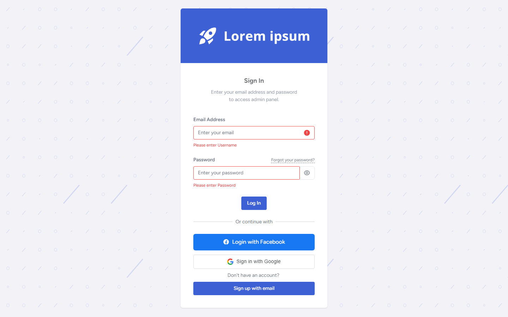
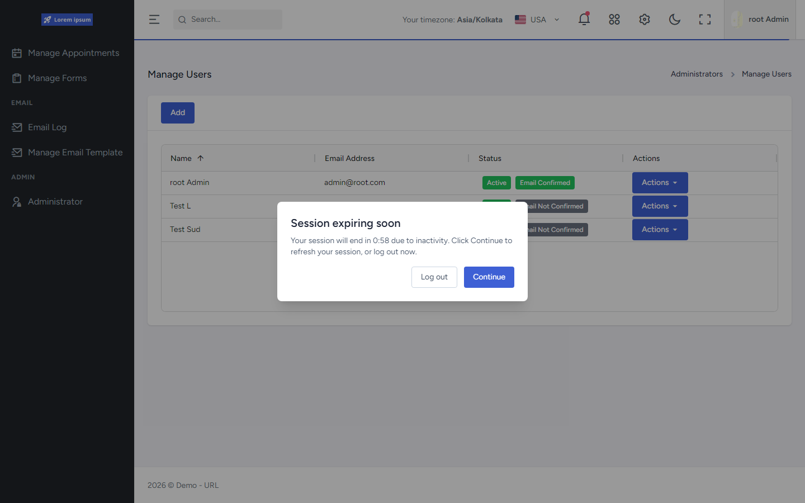

# FrontEnd Authentication

FrontEnd auth is a **session-aware client** for the API's [session-bound JWT](../../API/Authentication/README.md) model. The browser stores access/refresh material in `sessionStorage`, attaches Bearer tokens on API calls, and refreshes once on 401. **Backend session validation remains authoritative** on every authenticated request.

Related: [Routing](../Routing/README.md) · [State](../State/README.md) · [API Authentication](../../API/Authentication/README.md) · [API Authorization](../../API/Authorization/README.md)

Diagrams: [Single-flight refresh](../../assets/diagrams/frontend-single-flight-refresh/README.md) · [Routing / access gating](../../assets/diagrams/frontend-routing-gating/README.md)

## Verified capabilities

- Login/2FA/social success writes session payload via `APICore.setLoggedInUser`.
- Session stored in **`sessionStorage`** under key `portal_user` (tab-scoped).
- Access-token validity via `jwt-decode` (`exp`).
- Refresh validity via `refreshTokenExpiryTime` on the stored session object.
- Route "authenticated" can remain true while access JWT is expired **if** refresh expiry is still valid (then first API 401 triggers refresh).
- Silent refresh uses raw `fetch` to `/api/tokens/refresh` with single-flight queueing.
- `authenticatedFetch` attaches Bearer token; on 401 refreshes once and retries; prevents redirect loops.
- 403 redirects to `/access-denied` without clearing session.
- Unauthorized failure path revokes via logout API then hard-navigates to unauthorized logout.
- Idle warning modal (authenticated layout) can refresh-on-continue or log out; uses idle/warning minutes from session fields when present.
- Cross-tab logout signal uses a `localStorage` timestamp key (not token storage).

## Session storage (factual trade-off)

| Concern | Behavior |
|---------|----------|
| Primary store | `sessionStorage` (`portal_user`) |
| Lifetime | Cleared when the tab/window closes |
| Cross-tab tokens | Not shared across independent tabs |
| Logout broadcast | `localStorage` key for logout signaling only |
| XSS | Same-origin script can read storage (standard browser model) |

This is a deliberate tab-scoped session choice, not "remember me" persistence.

## Request / refresh flow

```text
NSwag client → authenticatedFetch
  → Authorization: Bearer <access token from sessionStorage>
  → if 401 (non-auth endpoint, first attempt):
       single-flight refreshAccessToken()
         → POST /api/tokens/refresh { token, refreshToken } via window.fetch
         → update sessionStorage on success
         → retry original request once
  → if refresh fails / still unauthorized:
       revoke logout API → clear portal_user → /auth/logout?type=unauthorized
  → if 403:
       navigate to /access-denied
```

Auth/token endpoints skip nested refresh (substring match on token routes) so the interceptor does not recurse.

Idle-modal "Continue" refreshes through `TokenService` / NSwag (separate from the 401 single-flight path).

## Alignment with backend session JWT

- The FrontEnd does **not** interpret server session id (`sid`) locally.
- Refresh always posts the current access + refresh pair to the API refresh endpoint.
- If the backend rejects refresh (revoked/idle/absolute/reuse/etc.), the client treats it as failed refresh and clears the local session.
- See API docs for idle/absolute timeouts, rotation, and reuse revocation.

## Idle session UX

- Hook mounted in authenticated vertical layout.
- Warning modal appears near idle expiry; activity tracking freezes once warning is shown.
- Continue → refresh tokens and reset idle clock; Log out / timeout → revoke + logout navigation.
- Defaults exist when session does not supply idle/warning minutes.





More detail: [login screenshot](../../assets/screenshots/login/README.md) · [session timeout screenshot](../../assets/screenshots/session-timeout/README.md)

## Two-factor authentication (client)

- Login saga detects `requiresTwoFactor` / `twoFactorSessionId` and routes to the 2FA challenge screen.
- Challenge UI supports Email (request/resend code) and Authenticator (6-digit TOTP) via Auth/Token services.
- **Manage Profile** includes `UserTwoFactorAuthentication` (enable/disable, choose Email vs Authenticator) and `EnableAuthenticator` (QR + shared-key entry + verify).
- Backend remains authoritative for challenge sessions, codes, and authenticator key storage — see [API Authentication — 2FA](../../API/Authentication/README.md).

Recovery codes are not part of the verified client flow. Authenticator setup screenshots are omitted (they expose setup secrets).

## Configuration

- `FrontEnd/src/config.ts` reads `VITE_API_URL` / `VITE_LOCAL_API_URL`.
- Clients prefer local API URL when set; `httpClient` can rewrite local→API URL for requests.

## Evidence

- `FrontEnd/src/helpers/api/apiCore.ts`
- `FrontEnd/src/helpers/api/httpClient.ts`
- `FrontEnd/src/helpers/api/sessionRefreshQueue.ts`
- `FrontEnd/src/helpers/api/apiClients.ts`
- `FrontEnd/src/helpers/api/WebApiClient.ts` (`TokensClient`)
- `FrontEnd/src/services/TokenService.ts`
- `FrontEnd/src/services/AuthService.ts`
- `FrontEnd/src/hooks/useIdleSessionTimeout.ts`
- `FrontEnd/src/components/SessionTimeoutModal.tsx`
- `FrontEnd/src/redux/auth/saga.ts`
- `FrontEnd/src/layouts/Vertical.tsx`
- `FrontEnd/src/pages/auth/TwoFactorAuthentication.tsx`
- `FrontEnd/src/pages/orbit/manage-profile/Components/UserTwoFactorAuthentication.tsx`
- `FrontEnd/src/pages/orbit/manage-profile/Components/EnableAuthenticator.tsx`
- `FrontEnd/src/redux/auth/saga.ts`
- `FrontEnd/src/config.ts`
