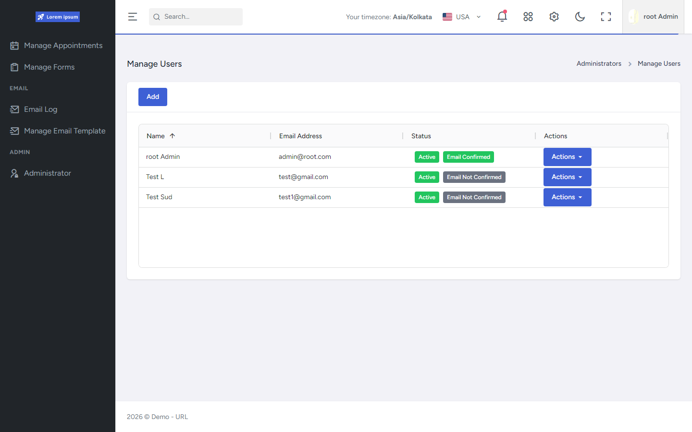

# FrontEnd Grids & Tables

Orbit list screens standardize on **AG Grid** through shared wrappers. Older/template table libraries may still be installed for demo pages, but they are not the Orbit production grid stack.

Related: [UI Architecture](../UI-Architecture/README.md) · [State](../State/README.md) · [Technology & Libraries](../Technology-Libraries.md)

## Verified capabilities

- Shared wrappers: `DataGridWithPagination` and `DataGridWithoutPagination` (`ag-grid-react`, quartz/legacy theme, auto-height layout).
- Shared helpers for default column defs, sorting comparators, sort-changed handling, expand/collapse utilities.
- `useGridReady` adjusts viewport sizing after grid ready.
- Shared `Pagination` component for server-paged result shapes (`currentPage`, `totalPages`, has previous/next).
- Column definitions, action columns, and row identity are **module-specific**.
- Empty AG Grid rows are common when data is empty; separate `EmptyState` is used in non-grid contexts more than inside the wrappers.
- Appointments primary list UX is FullCalendar; appointment detail can embed a non-paged grid for participants.
- **gridjs** appears in template UI tables + CSS imports only — not Orbit production lists.

## Why a shared abstraction exists

Wrappers centralize:

- AG Grid React binding and theme class
- Consistent pagination chrome for paged APIs
- Shared default column behavior helpers

Modules still own:

- Column definitions and formatters
- Action menus/buttons
- Fetch/paging orchestration
- Permission-aware actions (UI level)

## With vs without pagination

| Wrapper | Typical Orbit usage |
|---------|---------------------|
| With pagination | Tenants, email log/templates, forms hierarchy, lookup values, localization lists, … |
| Without pagination | Users, roles/permissions, lookup codes, countries, settings lists, assign-roles, … |

## Active vs legacy table tech

| Tech | Role in this repo |
|------|-------------------|
| AG Grid | Active Orbit shared grid architecture |
| gridjs | Template/demo tables only |
| Basic HTML tables | Template UI pages |

## Screenshot

Manage Users uses the shared AG Grid wrapper pattern (actions column, status badges, authenticated shell):

See [manage-users screenshot notes](../../assets/screenshots/manage-users/README.md).

## Evidence

- [`FrontEnd/src/components/DataGrid/DataGridWithPagination.tsx`](https://github.com/UjjwalSud/clean-architecture-10.0/blob/main/FrontEnd/src/components/DataGrid/DataGridWithPagination.tsx)
- [`FrontEnd/src/components/DataGrid/DataGridWithoutPagination.tsx`](https://github.com/UjjwalSud/clean-architecture-10.0/blob/main/FrontEnd/src/components/DataGrid/DataGridWithoutPagination.tsx)
- [`FrontEnd/src/helpers/grid.helper.ts`](https://github.com/UjjwalSud/clean-architecture-10.0/blob/main/FrontEnd/src/helpers/grid.helper.ts)
- [`FrontEnd/src/components/grid.helper.tsx`](https://github.com/UjjwalSud/clean-architecture-10.0/blob/main/FrontEnd/src/components/grid.helper.tsx)
- [`FrontEnd/src/hooks/agGrid.ts`](https://github.com/UjjwalSud/clean-architecture-10.0/blob/main/FrontEnd/src/hooks/agGrid.ts)
- [`FrontEnd/src/components/Pagination.tsx`](https://github.com/UjjwalSud/clean-architecture-10.0/blob/main/FrontEnd/src/components/Pagination.tsx)
- [`FrontEnd/src/components/EmptyState.tsx`](https://github.com/UjjwalSud/clean-architecture-10.0/blob/main/FrontEnd/src/components/EmptyState.tsx)
- [`FrontEnd/src/pages/ui/tables/DataTables.tsx`](https://github.com/UjjwalSud/clean-architecture-10.0/blob/main/FrontEnd/src/pages/ui/tables/DataTables.tsx) (gridjs template)
- [`FrontEnd/package.json`](https://github.com/UjjwalSud/clean-architecture-10.0/blob/main/FrontEnd/package.json) (`ag-grid-*`, `gridjs*`)
