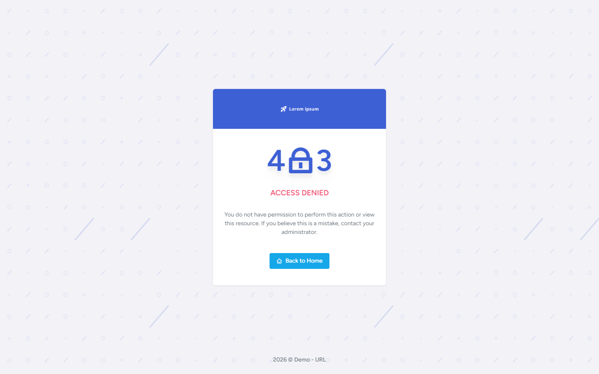

# FrontEnd Routing

Routing composes public and authenticated route modules, wraps them in layouts, and applies a **client-side auth gate** based on session helpers. This is **UX navigation control** — [API authorization](../../API/Authorization/README.md) remains the security boundary.

Related: [Authentication](../Authentication/README.md) · [State](../State/README.md) · [API Authorization](../../API/Authorization/README.md)

Diagram: [FrontEnd routing / access gating](../../assets/diagrams/frontend-routing-gating/README.md)

## Verified capabilities

- Public routes use `DefaultLayout`; authenticated product routes use `VerticalLayout`.
- Live auth gate is in `Routes.tsx` via `APICore.isUserAuthenticated()` / `hasSessionExired()`.
- Unauthenticated users are redirected to login (or unauthorized logout when refresh is expired).
- Authenticated `next` query is preserved on redirect where configured.
- Route modules are organized by domain (`authRoutes`, `orbitRoutes`, `dashboardRoutes`, `appsRoutes`, UI/pages in `index.tsx`).
- Most page components are `React.lazy`-loaded with Suspense boundaries in layouts.
- `/access-denied` is a public route; HTTP 403 from `authenticatedFetch` navigates there.
- Menu/button permission hooks filter UI using Redux permissions — **not** used as the route registrar.
- `PrivateRoute` component and per-route `roles` metadata exist but are **not mounted** by the current `Routes.tsx` composition (dead metadata today).



This page is UX only — [API Authorization](../../API/Authorization/README.md) is the security boundary. See [access-denied screenshot notes](../../assets/screenshots/access-denied/README.md).

## Architecture

```text
index.tsx → BrowserRouter → App → Routes.tsx
  → public flatten list → DefaultLayout + page
  → auth-protected flatten list →
       if authenticated → VerticalLayout + page
       else → Navigate to login or unauthorized logout
```

### Public examples

- Auth screens (login/register/logout/password/2FA variants)
- Subscription/payment confirmation surfaces
- Appointment start-meeting (and related public appointment links)
- Error pages including `/access-denied`, 404 catch-all

### Authenticated examples

- Dashboard
- Orbit administrator/product pages (users, roles, tenants, appointments, forms, …)
- Template app/UI demo routes (where included)

## Access control clarity

| Layer | What it does | What it is not |
|-------|----------------|----------------|
| `Routes.tsx` session check | Hides authenticated shell when no usable session | Not API authorization |
| Menu `usePermission*` | Hides/disables UI actions | Not a route ACL |
| Backend permissions | Enforces operations | Authoritative security boundary |
| 403 → Access Denied | UX for forbidden API calls | Does not by itself clear session |

Deep-linking a forbidden Orbit URL may still render the page shell until an API call returns 403.

## Lazy loading

- Route modules extensively use `React.lazy`.
- Layouts provide Suspense fallbacks for shell pieces and children.
- A small number of Orbit imports are static.

## Evidence

- [`FrontEnd/src/routes/Routes.tsx`](https://github.com/UjjwalSud/clean-architecture-10.0/blob/main/FrontEnd/src/routes/Routes.tsx)
- [`FrontEnd/src/routes/PrivateRoute.tsx`](https://github.com/UjjwalSud/clean-architecture-10.0/blob/main/FrontEnd/src/routes/PrivateRoute.tsx)
- [`FrontEnd/src/routes/index.tsx`](https://github.com/UjjwalSud/clean-architecture-10.0/blob/main/FrontEnd/src/routes/index.tsx)
- [`FrontEnd/src/routes/authRoutes.tsx`](https://github.com/UjjwalSud/clean-architecture-10.0/blob/main/FrontEnd/src/routes/authRoutes.tsx)
- [`FrontEnd/src/routes/orbitRoutes.tsx`](https://github.com/UjjwalSud/clean-architecture-10.0/blob/main/FrontEnd/src/routes/orbitRoutes.tsx)
- [`FrontEnd/src/routes/dashboardRoutes.tsx`](https://github.com/UjjwalSud/clean-architecture-10.0/blob/main/FrontEnd/src/routes/dashboardRoutes.tsx)
- [`FrontEnd/src/routes/appsRoutes.tsx`](https://github.com/UjjwalSud/clean-architecture-10.0/blob/main/FrontEnd/src/routes/appsRoutes.tsx)
- [`FrontEnd/src/routes/utils.ts`](https://github.com/UjjwalSud/clean-architecture-10.0/blob/main/FrontEnd/src/routes/utils.ts)
- [`FrontEnd/src/pages/error/AccessDenied.tsx`](https://github.com/UjjwalSud/clean-architecture-10.0/blob/main/FrontEnd/src/pages/error/AccessDenied.tsx)
- [`FrontEnd/src/helpers/api/httpClient.ts`](https://github.com/UjjwalSud/clean-architecture-10.0/blob/main/FrontEnd/src/helpers/api/httpClient.ts)
- [`FrontEnd/src/hooks/usePermission.ts`](https://github.com/UjjwalSud/clean-architecture-10.0/blob/main/FrontEnd/src/hooks/usePermission.ts)
- [`FrontEnd/src/constants/menu.ts`](https://github.com/UjjwalSud/clean-architecture-10.0/blob/main/FrontEnd/src/constants/menu.ts)
- [`FrontEnd/src/layouts/Default.tsx`](https://github.com/UjjwalSud/clean-architecture-10.0/blob/main/FrontEnd/src/layouts/Default.tsx)
- [`FrontEnd/src/layouts/Vertical.tsx`](https://github.com/UjjwalSud/clean-architecture-10.0/blob/main/FrontEnd/src/layouts/Vertical.tsx)
