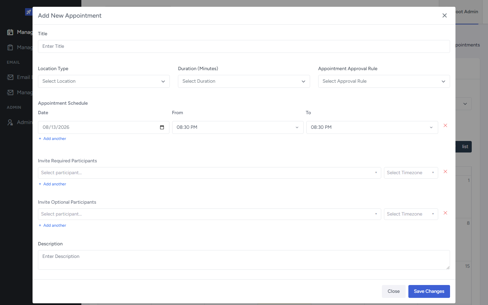

# FrontEnd UI Architecture

Reusable UI is organized as shared building blocks (forms, modals, toasts, grids, page chrome) plus module-specific controllers where workflows are more complex. This is not a single design-system package — Orbit product screens compose shared shells with page-local columns, actions, and modal orchestration.

Related: [Forms & Validation](../Forms-Validation/README.md) · [Grids & Tables](../Grids-Tables/README.md) · [Authentication](../Authentication/README.md) · [Routing](../Routing/README.md)

## Verified capabilities

- Shared component barrel for common form/page primitives (`VerticalForm`, `FormInput`, Popup chrome, Pagination, EmptyState, FileUploader, …).
- Headless UI wrappers for modal/offcanvas/popover (`ModalLayout` and related layouts).
- Route-level `ErrorBoundary` around routed content.
- Central toast/error pipeline via `messageHelper` (+ optional expandable technical toast content).
- Async helper `runWithToast` for consistent success/error toast handling.
- HTTP-layer dedupe so the same API error is not toasted twice.
- Dominant Orbit modal shell: `ModalLayout` + Popup header/body/footer.
- Delete confirmation uses a shared destructive confirm component across many Orbit screens.
- Appointment workflows use a dedicated modal state + controller pattern (module-specific).
- Many list screens use a lighter `useModalState` pattern instead of a full controller package.
- Shared hooks for permissions, object/modal state, domain data loaders, idle timeout, SignalR, grid ready.

See [appointment-modal screenshot](../../assets/screenshots/appointment-modal/README.md).

## How reusable UI is structured

### Centralized

| Concern | Approach |
|---------|----------|
| Form fields / vertical form | Shared `VerticalForm` + `FormInput` |
| Modal chrome | `ModalLayout` + Popup variants |
| Toasts / API errors | `messageHelper`, `ErrorToast`, `httpClient` display guard |
| List tables | Shared DataGrid wrappers (see Grids) |
| Page chrome | breadcrumbs, preloaders, EmptyState, PageFilter (path-imported) |

### Module-specific

| Concern | Approach |
|---------|----------|
| Column definitions / row actions | Defined per Orbit page |
| Appointment multi-modal flow | `AppointmentModalState` + `useAppointmentModalController` + `AppointmentModals` |
| Complex appointment forms | Page-local `useForm` composition (see Forms) |
| Settings editors | Sometimes FormInput outside VerticalForm |

## Representative Orbit admin modules

These product screens illustrate shared UI patterns (not separate architecture packages):

| Module | Pattern demonstrated |
|--------|----------------------|
| Manage Users / Roles | AG Grid list + VerticalForm CRUD modals |
| Manage Tenants | Root-only grid + tabbed edit — [Tenant Administration](../Tenant-Administration/README.md) |
| Manage Settings | Tenant Orbit settings (Appointment / ApprovedAppointment) with nested editors and tabbed landing — forms that are **not** always VerticalForm wrappers |
| Manage Language | Localization admin — see [API Localization](../../API/Localization/README.md) |
| Manage Lookups / Nexus Lookups | Typed reference-data admin — see [Platform Foundation — LookUps](../../API/Platform-Foundation/README.md#centralized-reference-data-lookups) |
| Email Log / Templates | Mail admin surfaces — see [API Mailing](../../API/Mailing/README.md) |

Settings is a real administration feature for appointment-related configuration. It does not introduce a generic “settings framework” beyond service + controller + Orbit UI composition. Sensitive business config values are not documented here.

## Appointment modal controller (pattern)

Appointments centralize open/close/reload for add/view/reschedule/cancel in a small b-logic package, then render multiple `ModalLayout` hosts. Most other Orbit CRUD pages keep modal open state closer to the page (`useModalState`) rather than extracting a controller.

## Evidence

- `FrontEnd/src/components/index.tsx`
- `FrontEnd/src/components/HeadlessUI/ModalLayout.tsx`
- `FrontEnd/src/components/ErrorBoundary/index.tsx`
- `FrontEnd/src/components/ErrorToast/index.tsx`
- `FrontEnd/src/helpers/message.helper.ts`
- `FrontEnd/src/helpers/asyncToast.helper.ts`
- `FrontEnd/src/components/ConfirmationModal.tsx`
- `FrontEnd/src/components/DeleteConfirmation.tsx`
- `FrontEnd/src/components/Popup/`
- `FrontEnd/src/pages/orbit/manage-appointments/b-logic/AppointmentModalState.ts`
- `FrontEnd/src/pages/orbit/manage-appointments/b-logic/useAppointmentModalController.ts`
- `FrontEnd/src/pages/orbit/manage-appointments/Components/AppointmentModals.tsx`
- `FrontEnd/src/pages/orbit/manage-settings/`
- `FrontEnd/src/hooks/`
- `FrontEnd/src/routes/Routes.tsx`
- `FrontEnd/src/App.tsx`
