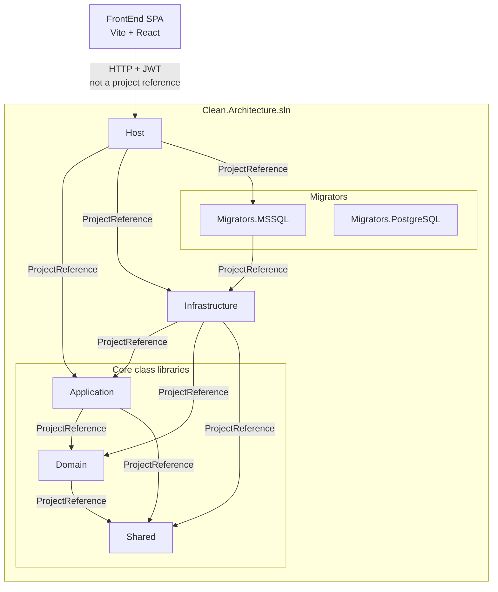
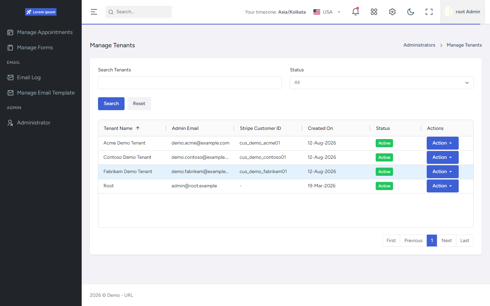

# Clean Architecture 10.0 Showcase

This repository is a public technical showcase of a **private .NET 10 Clean Architecture foundation** used as a reusable starting point for modern .NET and React applications.

It documents verified capabilities, security and multi-tenancy design, frontend architecture, diagrams, UI examples, and an AI-assisted engineering workflow — without publishing the reusable implementation itself.

The underlying implementation is intentionally private. This repository focuses on architecture, verified capabilities, diagrams, UI examples, and engineering practices.

## Development acceleration

The private foundation already solves common infrastructure concerns (authentication/session security including optional 2FA, authorization, multi-tenancy and subscription-aware platform pieces, persistence, jobs, caching, file storage, multi-provider email, integrations, observability, localization hooks, and shared FrontEnd patterns). New product work can start from those established patterns instead of rebuilding the same platform pieces for every application, and focus sooner on domain and business requirements. It is suitable as a starting architecture for SaaS and business applications.

## Architecture

The API solution is seven projects. **Solid arrows are compile-time `ProjectReference`s.** The FrontEnd SPA is outside the `.sln` and talks to Host over HTTP with JWT.



- **Shared** — no project references  
- **Domain** → Shared · **Application** → Domain, Shared (neither references Infrastructure)  
- **Infrastructure** — EF Core, auth, jobs, integrations; references Application, Domain, Shared  
- **Host** — composition root; references Application, Infrastructure, **Migrators.MSSQL**  
- **Migrators.PostgreSQL** — in the solution; **not** referenced by Host (provider wiring exists; migrations not shipped)

Deeper diagrams: [solution project dependencies](./assets/diagrams/solution-project-dependencies/README.md) · [overall Clean Architecture](./assets/diagrams/overall-clean-architecture/README.md)

Evidence paths throughout this showcase (for example `API/src/...`, `FrontEnd/src/...`, `.cursor/...`) refer to files in the private source architecture represented here.

## Major capabilities

| Area | What is implemented |
|------|---------------------|
| Backend | .NET 10 Clean Architecture (Domain / Application / Infrastructure / Host) |
| FrontEnd | React 19 + TypeScript SPA (Vite), NSwag clients, Redux Toolkit + Saga |
| Authentication | Session-bound JWT, refresh-token hashing + rotation, reuse revocation, idle/absolute timeouts; optional Email/Authenticator 2FA |
| Authorization | Permission policies from DB role claims (not JWT-embedded permissions) |
| Multi-tenancy / SaaS foundation | Multi-layer isolation plus tenant admin, default/free subscription assignment, Stripe upgrade path; centralized Application + Nexus reference-data lookups |
| Persistence | EF Core, multi-DbContext layout, soft delete, auditing; SQL Server migrations shipped |
| Background jobs | Hangfire on SQL Server storage (filters, recurring session purge) |
| Caching | Local / distributed-memory cache with tenant-prefixed keys (Redis wiring present but not active) |
| Security | HTTPS/HSTS, security headers, CORS allowlists, rate limiting; optional Azure Key Vault / AWS secrets providers; FrontEnd sessionStorage + idle UX (CSP via hosting docs) |
| API surface | OpenAPI / NSwag, thin controllers; Asp.Versioning (mostly version-neutral routes) |
| Integrations | Stripe payments, Jitsi meetings, file storage providers (local / S3 / Azure Blob) |
| Email | Multi-provider mailing (SendGrid / Resend / SMTP), Hangfire enqueue, email logs |
| Localization | Country + string catalog API with i18next FrontEnd runtime |
| Real-time | SignalR notifications hub (FrontEnd hub connect exists; dropdown UI not yet consuming events) |
| AI engineering | Project `.cursor` rules/docs/prompts — governed, plan-first assistance |

Details live under [API](./API/README.md) and [FrontEnd](./FrontEnd/README.md).

## Explore

| Section | Contents |
|---------|----------|
| [API](./API/README.md) | Backend architecture, security, authz, tenancy/SaaS foundation, mailing, persistence, jobs |
| [FrontEnd](./FrontEnd/README.md) | SPA architecture, session client, security posture, routing, tenant admin, UI patterns |
| [Cursor / AI Engineering](./Cursor/README.md) | How Cursor is governed for this codebase |
| [Architecture diagrams](./assets/diagrams/README.md) | Mermaid flow and dependency diagrams |
| [Screenshots](./assets/screenshots/README.md) | Real UI evidence from the running application |

## UI evidence

Permission-aware administration and the shared Orbit grid pattern:




Full gallery: [assets/screenshots](./assets/screenshots/README.md)

## Related repositories

| Repository | Role |
|------------|------|
| [ai-engineering-system](https://github.com/UjjwalSud/ai-engineering-system) | Public reusable AI-assisted engineering system — rules, prompts, stack guidance, planning conventions, and workflow patterns |
| [clean-architecture-10.0-showcase](https://github.com/UjjwalSud/clean-architecture-10.0-showcase) | This public showcase — architecture explanation, diagrams, and UI evidence |

Relationship in short:

```text
ai-engineering-system            → reusable AI-assisted engineering guidance
        ↓ (applied to a private foundation)
private .NET 10 Clean Architecture → concrete reusable implementation
        ↓ (documented by)
clean-architecture-10.0-showcase → this public technical showcase
```

This project’s `.cursor` setup is a **project-specific application** of that broader engineering approach — not a verbatim copy of every rule from `ai-engineering-system`.

## Contact

If you're building a .NET/React application and are interested in using this architecture as a foundation, feel free to reach out through my [GitHub profile](https://github.com/UjjwalSud).
