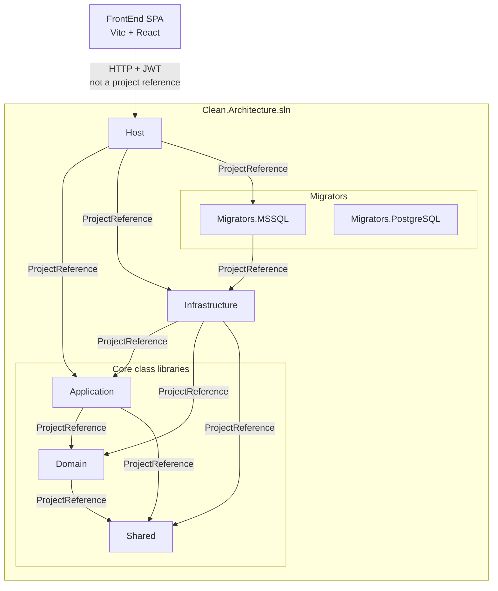

# Clean Architecture 10.0 Showcase

Public technical showcase for the **.NET 10 Clean Architecture** solution at:

**[github.com/UjjwalSud/clean-architecture-10.0](https://github.com/UjjwalSud/clean-architecture-10.0)**

This repository documents and illustrates that architecture. It does **not** contain the application source — the runnable API and React SPA live in the architecture repository above.

## Architecture

The API solution is seven projects. **Solid arrows are compile-time `ProjectReference`s.** The FrontEnd SPA is outside the `.sln` and talks to Host over HTTP with JWT.



- **Shared** — no project references  
- **Domain** → Shared · **Application** → Domain, Shared (neither references Infrastructure)  
- **Infrastructure** — EF Core, auth, jobs, integrations; references Application, Domain, Shared  
- **Host** — composition root; references Application, Infrastructure, **Migrators.MSSQL**  
- **Migrators.PostgreSQL** — in the solution; **not** referenced by Host (provider wiring exists; migrations not shipped)

Deeper diagrams: [solution project dependencies](./assets/diagrams/solution-project-dependencies/README.md) · [overall Clean Architecture](./assets/diagrams/overall-clean-architecture/README.md)

## Major capabilities

| Area | What is implemented |
|------|---------------------|
| Backend | .NET 10 Clean Architecture (Domain / Application / Infrastructure / Host) |
| FrontEnd | React 19 + TypeScript SPA (Vite), NSwag clients, Redux Toolkit + Saga |
| Authentication | Session-bound JWT, refresh-token hashing + rotation, reuse revocation, idle/absolute timeouts |
| Authorization | Permission policies from DB role claims (not JWT-embedded permissions) |
| Multi-tenancy | Multi-layer isolation (token, session, EF Application filter, Nexus service filters, cache keys, SignalR groups) |
| Persistence | EF Core, multi-DbContext layout, soft delete, auditing; SQL Server migrations shipped |
| Background jobs | Hangfire on SQL Server storage (filters, recurring session purge) |
| Caching | Local / distributed-memory cache with tenant-prefixed keys (Redis wiring present but not active) |
| Security | HTTPS/HSTS, security headers, CORS allowlists, rate limiting, request pipeline hardening |
| API surface | OpenAPI / NSwag, thin controllers over Application service interfaces |
| Integrations | Stripe payments, Jitsi meetings, file storage providers (local / S3 / Azure Blob) |
| Real-time | SignalR notifications hub (FrontEnd hub connect exists; dropdown UI not yet consuming events) |
| AI engineering | Project `.cursor` rules/docs/prompts — governed, plan-first assistance |

Details live under [API](./API/README.md) and [FrontEnd](./FrontEnd/README.md).

## Explore

| Section | Contents |
|---------|----------|
| [API](./API/README.md) | Backend architecture, security, authz, persistence, jobs, integrations |
| [FrontEnd](./FrontEnd/README.md) | SPA architecture, session client, routing, state, UI patterns |
| [Cursor / AI Engineering](./Cursor/README.md) | How Cursor is governed for this codebase |
| [Architecture diagrams](./assets/diagrams/README.md) | Mermaid flow and dependency diagrams |
| [Screenshots](./assets/screenshots/README.md) | Real UI evidence from the running application |

## UI evidence

Permission-aware administration and the shared Orbit grid pattern:


Full gallery: [assets/screenshots](./assets/screenshots/README.md)

## Related repositories

| Repository | Role |
|------------|------|
| [clean-architecture-10.0](https://github.com/UjjwalSud/clean-architecture-10.0) | **Architecture source** — the .NET API and React SPA this showcase documents |
| [ai-engineering-system](https://github.com/UjjwalSud/ai-engineering-system) | **Reusable AI engineering system** — rules, prompts, stack guidance, planning conventions, and workflow patterns applied across projects |
| [clean-architecture-10.0-showcase](https://github.com/UjjwalSud/clean-architecture-10.0-showcase) | **This repository** — public explanation, diagrams, and UI evidence |

Relationship in short:

```text
ai-engineering-system          → reusable AI-assisted engineering guidance
        ↓ (applied / specialized)
clean-architecture-10.0        → concrete architecture implementation
        ↓ (documented by)
clean-architecture-10.0-showcase → public technical showcase
```

This project’s `.cursor` setup is a **project-specific application** of that broader engineering approach — not a verbatim copy of every rule from `ai-engineering-system`.
