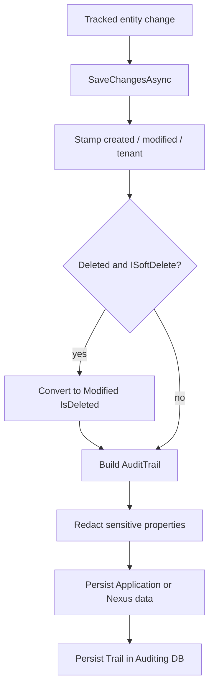

# Audit trail and soft delete

## What this diagram shows

On save, auditable entities get metadata stamps. Soft-deletable deletes become updates. Change trails are written to a **separate** auditing database after sensitive fields are redacted.

## Why it matters

Business rows and audit history are different stores. Soft delete keeps rows query-filtered (`!IsDeleted`) instead of hard-deleting.

## Key points

- Application `BaseDbContext` also applies a tenant global filter; Nexus base does not.
- Redaction covers password/refresh-token/authenticator/connection-string style names.
- Soft-delete modifications are recorded as delete-type trails.

## Evidence

- `API/src/Infrastructure/Persistence/Context/BaseDbContext.cs`
- `API/src/Infrastructure/Auditing/AuditTrail.cs`
- `API/src/Infrastructure/Persistence/Context/Auditing/AuditingDbContext.cs`
- `API/src/Core/Domain/Common/Contracts/ISoftDelete.cs`

## Related documentation

- [API Persistence](../../../API/Persistence/README.md)
- [API Observability](../../../API/Observability/README.md)
