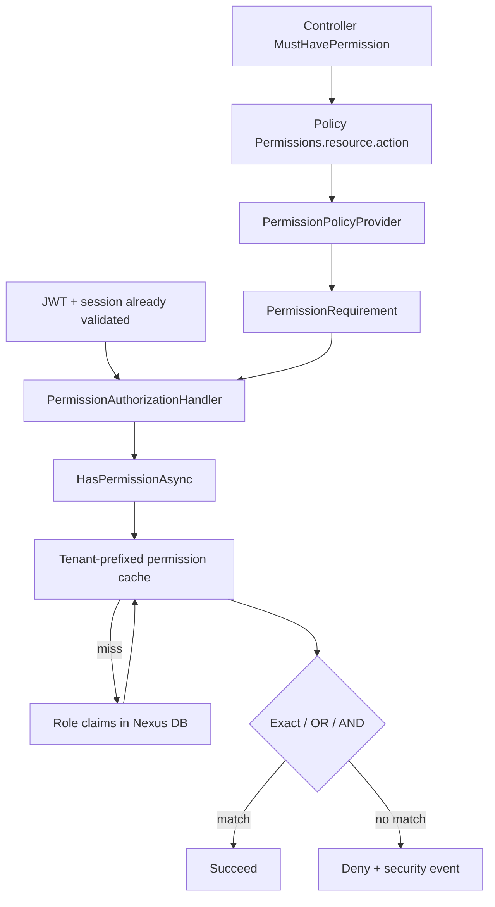

# Authorization policy resolution

## What this diagram shows

How a controller permission attribute becomes a dynamic ASP.NET Core policy, then a DB-backed permission check.

## Why it matters

Permissions are **not** carried as JWT roles. The access token identifies the user/session/tenant; authorization loads role claims from Nexus (cached).

## Key points

- Policy names follow `Permissions.{resource}.{action}`; composites join with OR / AND.
- FrontEnd menu/route visibility is UX only — this handler is the API security boundary.
- Cache keys are tenant-prefixed; role permission updates invalidate cache.

## Evidence

- `API/src/Infrastructure/Auth/Permissions/MustHavePermissionAttribute.cs`
- `API/src/Infrastructure/Auth/Permissions/PermissionPolicyProvider.cs`
- `API/src/Infrastructure/Auth/Permissions/PermissionAuthorizationHandler.cs`
- `API/src/Infrastructure/Nexus/Identity/UserService.Permissions.cs`

## Related documentation

- [API Authorization](../../../API/Authorization/README.md)
- [API Authentication](../../../API/Authentication/README.md)
- [FrontEnd Routing](../../../FrontEnd/Routing/README.md)
