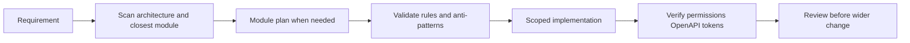

# Cursor engineering workflow

## What this diagram shows

How `.cursor` steers AI-assisted work: understand the real architecture, plan larger slices, obey layer rules, implement narrowly, then verify. Broader reusable patterns: [ai-engineering-system](https://github.com/UjjwalSud/ai-engineering-system).

## Why it matters

The showcase is not “we use an AI editor.” It is **rules + reference modules + plan-first** so generated code matches this service-based Clean Architecture.

## Key points

- New modules: return a Module Plan before generating files.
- Copy FormDesigner (or the documented peer) instead of textbook CQRS/MediatR/repos unless requested.
- Full rule files and prompts stay unpublished; see sanitization policy.

## Evidence

- [`.cursor/AGENTS.md`](https://github.com/UjjwalSud/clean-architecture-10.0/blob/main/.cursor/AGENTS.md)
- [`.cursor/docs/MODULE_OUTPUT_FORMAT.md`](https://github.com/UjjwalSud/clean-architecture-10.0/blob/main/.cursor/docs/MODULE_OUTPUT_FORMAT.md)
- [`.cursor/docs/REFERENCE_MODULES.md`](https://github.com/UjjwalSud/clean-architecture-10.0/blob/main/.cursor/docs/REFERENCE_MODULES.md)
- [`.cursor/docs/ANTI_PATTERNS.md`](https://github.com/UjjwalSud/clean-architecture-10.0/blob/main/.cursor/docs/ANTI_PATTERNS.md)

## Related documentation

- [Cursor overview](../../../Cursor/README.md)
- [Engineering Workflow](../../../Cursor/Engineering-Workflow/README.md)
- [Curated Rules](../../../Cursor/Rules-Curated/README.md)
