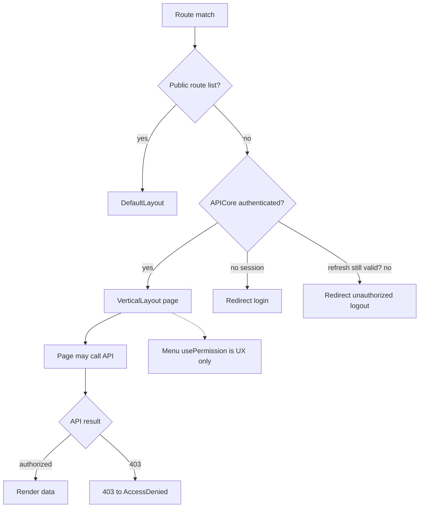

# FrontEnd routing / access gating

## What this diagram shows

The **current** composition in `Routes.tsx`: public vs authenticated lists, session helper gate, then API as the real permission check.

## Why it matters

This is navigation UX, not a security boundary. `PrivateRoute` and per-route `roles` metadata exist in source but are **not mounted** here.

## Key points

- Authenticated = valid access JWT **or** still-valid refresh expiry (then 401 refresh may run).
- Expired refresh → unauthorized logout redirect.
- Menu/button `usePermission` hides UI; deep links can still render until the API returns 403.
- Backend [authorization](../../../API/Authorization/README.md) remains authoritative.

## Evidence

- `FrontEnd/src/routes/Routes.tsx`
- `FrontEnd/src/helpers/api/apiCore.ts`
- `FrontEnd/src/helpers/api/httpClient.ts`
- `FrontEnd/src/routes/PrivateRoute.tsx`

## Related documentation

- [FrontEnd Routing](../../../FrontEnd/Routing/README.md)
- [FrontEnd Authentication](../../../FrontEnd/Authentication/README.md)
- [API Authorization](../../../API/Authorization/README.md)
