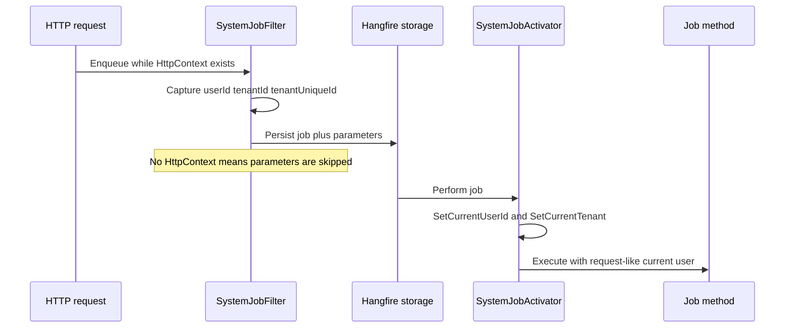

# Hangfire tenant / user job context

## What this diagram shows

When a job is created from an HTTP request, user and tenant are stored as Hangfire job parameters and restored into `ICurrentUserInitializer` when the job runs.

## Why it matters

Background work can keep the same tenant/user ambient context used by EF filters and services — it does not silently become “no tenant.”

## Key points

- Capture happens only when `HttpContext` is present (request-originated jobs).
- Recurring jobs such as session purge are not request-scoped; they do not rely on this capture path.
- `LogJobFilter` logs create/perform/failure separately from context propagation.

## Evidence

- `API/src/Infrastructure/BackgroundJobs/SystemJobFilter.cs`
- `API/src/Infrastructure/BackgroundJobs/SystemJobActivator.cs`
- `API/src/Infrastructure/BackgroundJobs/Startup.cs`

## Related documentation

- [API Background Jobs](../../../API/BackgroundJobs/README.md)
- [API Multi-Tenancy](../../../API/MultiTenancy/README.md)
