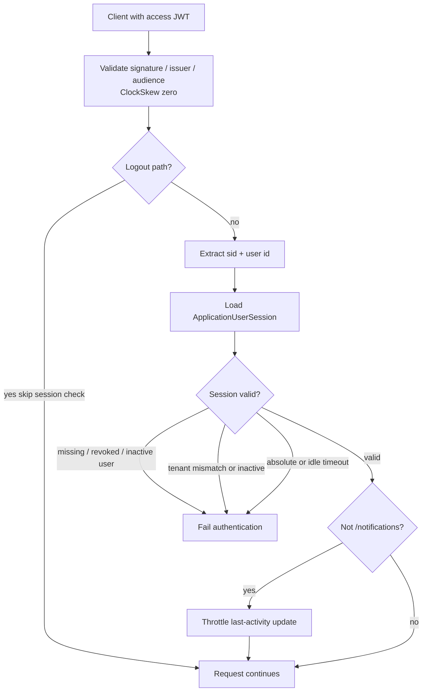

# JWT + session validation

## What this diagram shows

Authenticated requests are **session-bound**: a valid JWT signature is not enough. After JWT validation, `OnTokenValidated` loads `sid` and re-checks the database session.

## Why it matters

Idle timeout, absolute timeout, tenant match, and revocation can reject a still-unexpired access token.

## Key points

- Logout and logout-all skip session validation so an idle/revoked token can still revoke.
- SignalR `/notifications` can take `access_token` from the query string; activity is **not** updated on that path.
- Session checks run in this order: exists → user match → not revoked → user active → tenant match → tenant active (non-root) → absolute → idle → optional activity bump.

## Evidence

- `API/src/Infrastructure/Auth/Jwt/ConfigureJwtBearerOptions.cs`
- `API/src/Infrastructure/Nexus/Identity/UserSessionService.cs`

## Related documentation

- [API Authentication](../../../API/Authentication/README.md)
- [API Multi-Tenancy](../../../API/MultiTenancy/README.md)
