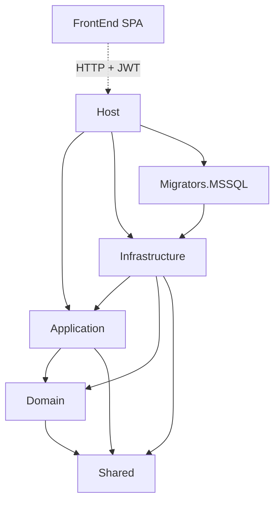

# Overall Clean Architecture

For **exact `ProjectReference` edges** (including Migrators.PostgreSQL in the solution with no Host reference), see [Solution project dependencies](../solution-project-dependencies/README.md).

## What this diagram shows

Layered solution shape: SPA talks to Host over HTTP; Host and Infrastructure sit on Application/Domain/Shared; MSSQL migrator is the packaged migration assembly.

## Why it matters

This is a service + DbContext architecture, not a generic onion with repositories. Dependencies point toward Domain/Shared; Infrastructure implements Application contracts.

## Key points

- FrontEnd is not a .NET project reference.
- Host references Application, Infrastructure, and Migrators.MSSQL.
- Migrators.MSSQL references Infrastructure (EF migrations live next to the model).
- Application and Domain do not reference Infrastructure.

## Evidence

- `API/src/Host/Host.csproj`
- `API/src/Infrastructure/Infrastructure.csproj`
- `API/src/Core/Application/Application.csproj`
- `.cursor/docs/01_SYSTEM_ARCHITECTURE.md`

## Related documentation

- [Solution project dependencies](../solution-project-dependencies/README.md)
- [API overview](../../../API/README.md)
- [Root README](../../../README.md)
