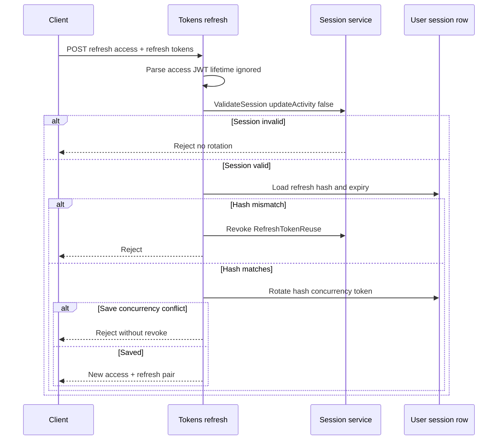

# Refresh-token rotation

## What this diagram shows

The refresh endpoint accepts an **expired** access token (lifetime not required), re-validates the session, compares the presented refresh token to a stored **hash**, then rotates to a new pair.

## Why it matters

Refresh is session-bound and rotating. Reuse of an old refresh token revokes the session. A multi-tab race rejects the loser **without** revoking the winner.

## Key points

- Only the hash is stored; compare is constant-time.
- `ValidateSessionAsync` is called with `updateActivity: false` — refresh does **not** extend idle.
- Hash mismatch → `RefreshTokenReuse` revoke.
- `DbUpdateConcurrencyException` → reject without revoke.

## Evidence

- `API/src/Infrastructure/Nexus/Identity/TokenService.cs`
- `API/src/Infrastructure/Nexus/Identity/RefreshTokenHasher.cs`
- `API/src/Infrastructure/Nexus/Identity/UserSessionService.cs`

## Related documentation

- [API Authentication](../../../API/Authentication/README.md)
- [FrontEnd single-flight refresh](../frontend-single-flight-refresh/README.md)
