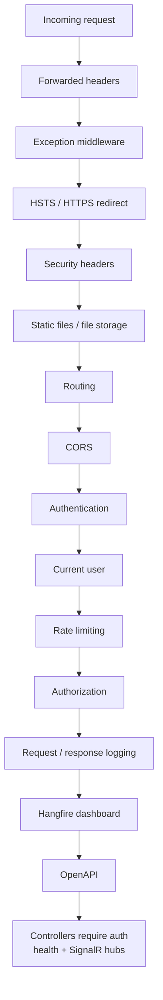

# API request / security pipeline

## What this diagram shows

The **actual** `UseInfrastructure` order, then `MapEndpoints`.

## Why it matters

Security stages are ordered on purpose: exception handling wraps later failures; HSTS/HTTPS redirect run after the exception middleware; rate limiting runs **after** authentication so user-keyed partitions are possible.

## Key points

- Several stages are config-gated (forwarded headers, HSTS, rate limiting, request logging, Hangfire dashboard, OpenAPI).
- Controllers are mapped with `RequireAuthorization()`; anonymous is explicit.
- Exact rate-limit numbers are not shown.

## Evidence

- `API/src/Infrastructure/Startup.cs`
- `API/src/Infrastructure/Https/Startup.cs`
- `API/src/Infrastructure/RateLimiting/Startup.cs`

## Related documentation

- [API Security](../../../API/Security/README.md)
- [API overview](../../../API/README.md)
