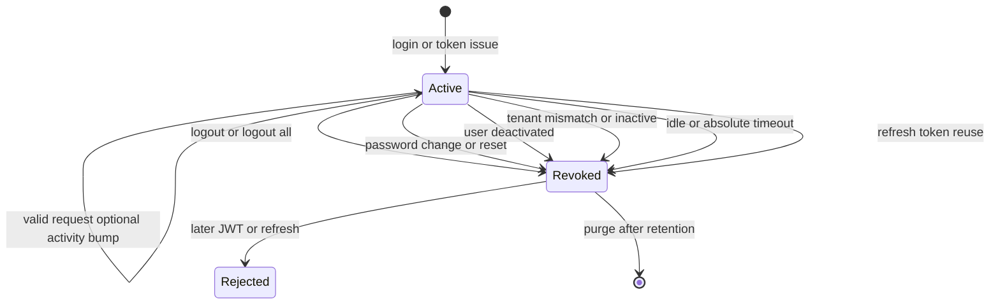

# Session lifecycle and revocation

## What this diagram shows

A session starts at token issuance and stays usable only while validation succeeds. Security events move it to **revoked**; later requests fail. Aged rows are purged by a daily job.

## Why it matters

Access JWT `exp` is not the only clock. Idle, absolute timeout, tenant, and reuse can end the session independently.

## Key points

- Reason codes are grouped: explicit logout, credential/user changes, tenant, timeouts, refresh reuse.
- Explicit revoke paths clear the refresh hash; timeout/tenant mismatch paths mark the session revoked (later validate still fails).
- Hangfire `purge-expired-user-sessions` deletes old session rows (retention), not “keep expired forever.”

## Evidence

- `API/src/Core/Application/Nexus/Identity/Sessions/UserSessionRevocationReasons.cs`
- `API/src/Infrastructure/Nexus/Identity/UserSessionService.cs`
- `API/src/Infrastructure/Startup.cs` (`RegisterRecurringJobs`)

## Related documentation

- [API Authentication](../../../API/Authentication/README.md)
- [API Observability](../../../API/Observability/README.md)
- [Background Jobs](../../../API/BackgroundJobs/README.md)
