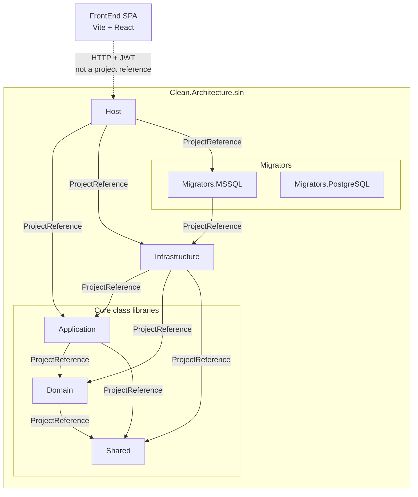

# Solution project dependencies

## What this diagram shows

Compile-time **project references** inside `Clean.Architecture.sln`, plus the FrontEnd SPA as a separate runtime client (not a `.csproj` reference).

## Why it matters

A first-time visitor can see which class libraries exist, who references whom, and that Application/Domain never reference Infrastructure.

## Key points

| Project | References |
|---------|------------|
| Shared | none |
| Domain | Shared |
| Application | Domain, Shared |
| Infrastructure | Application, Domain, Shared |
| Host | Application, Infrastructure, Migrators.MSSQL |
| Migrators.MSSQL | Infrastructure |
| Migrators.PostgreSQL | **none** — in the solution, not referenced by Host |
| FrontEnd | HTTP to Host only |

Solid arrows = `ProjectReference`. Dashed arrow = runtime HTTP.

## Evidence

- `API/src/Core/Domain/Domain.csproj`
- `API/src/Core/Application/Application.csproj`
- `API/src/Infrastructure/Infrastructure.csproj`
- `API/src/Host/Host.csproj`
- `API/src/Migrators/Migrators.MSSQL/Migrators.MSSQL.csproj`
- `API/src/Migrators/Migrators.PostgreSQL/Migrators.PostgreSQL.csproj`

## Related documentation

- [Root README](../../../README.md)
- [Overall Clean Architecture](../overall-clean-architecture/README.md)
- [API overview](../../../API/README.md)
