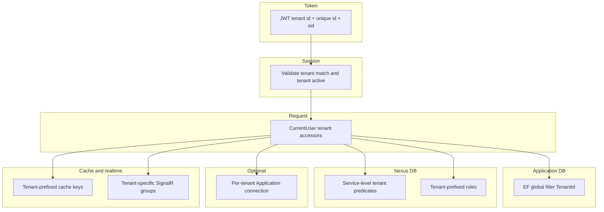

# Multi-tenant isolation layers

## What this diagram shows

Tenant isolation is **several cooperating layers**, not one middleware feature.

## Why it matters

Application data uses an EF global tenant filter. Nexus/identity data does **not** — services filter by tenant explicitly. Optional per-tenant Application connection strings can split databases.

## Key points

- JWT carries tenant context; session validation can revoke on mismatch or inactive tenant (non-root).
- Cache keys default to tenant unique id prefixes.
- Realtime delivery uses tenant-specific SignalR groups.

## Evidence

- `API/src/Infrastructure/Nexus/Identity/TokenService.cs`
- `API/src/Infrastructure/Persistence/Context/BaseDbContext.cs`
- `API/src/Infrastructure/Persistence/Context/Nexus/NexusBaseDbContext.cs`
- `API/src/Infrastructure/Caching/CacheKeyService.cs`
- `API/src/Infrastructure/Notifications/NotificationHub.cs`

## Related documentation

- [API Multi-Tenancy](../../../API/MultiTenancy/README.md)
- [API Persistence](../../../API/Persistence/README.md)
- [API Notifications](../../../API/Notifications/README.md)
