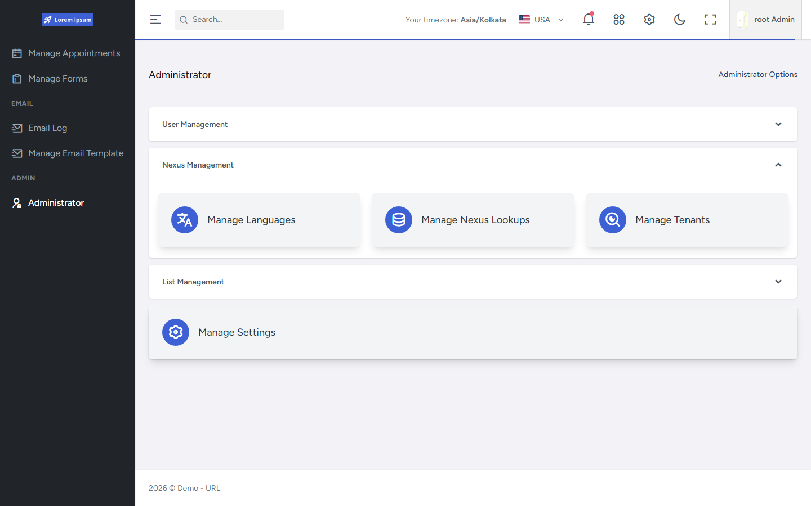

# Administrator submenu

## What this shows

The Orbit **Administrator** landing page (`/sub/administrator`): accordion groups for User Management, Nexus Management, and List Management with card links into admin modules.

This capture shows **Nexus Management** expanded (Manage Language, Manage Nexus Lookups, Manage Tenants).

## Capability demonstrated

Permission-aware administration entry points — cards appear based on the signed-in user's permissions.

## Evidence

- `FrontEnd/src/pages/orbit/view-sub-menus/Components/AdministratorMenus.tsx`
- `FrontEnd/src/routes/` (`/sub/administrator`)
- `FrontEnd/src/constants/menu.ts` (`ViewAdministratorSubMenu`)

## Related documentation

- [FrontEnd Tenant Administration](../../../FrontEnd/Tenant-Administration/README.md)
- [API Localization](../../../API/Localization/README.md)
- [API Platform Foundation — LookUps](../../../API/Platform-Foundation/README.md#centralized-reference-data-lookups)
