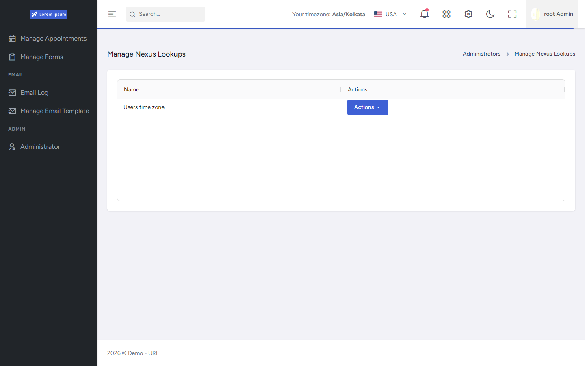

# Manage Nexus Lookups

## What this shows

Orbit **Manage Nexus Lookups** list: platform reference-data codes (for example Users time zone) with Actions into value maintenance.

## Capability demonstrated

Nexus/platform lookup administration — distinct from Application (Orbit) lookups. Runtime dropdowns consume these values via `DropDownService` / `DataControllers`.

## Evidence

- `FrontEnd/src/pages/orbit/manage-nexus-lookups/`
- `API/src/Host/Controllers/LookUp/NexusLookUpController.cs`
- `API/src/Infrastructure/Nexus/Lookup/NexusLookUpService.cs`

## Related documentation

- [API Platform Foundation — LookUps](../../../API/Platform-Foundation/README.md#centralized-reference-data-lookups)
- [FrontEnd State — lookups](../../../FrontEnd/State/README.md)
