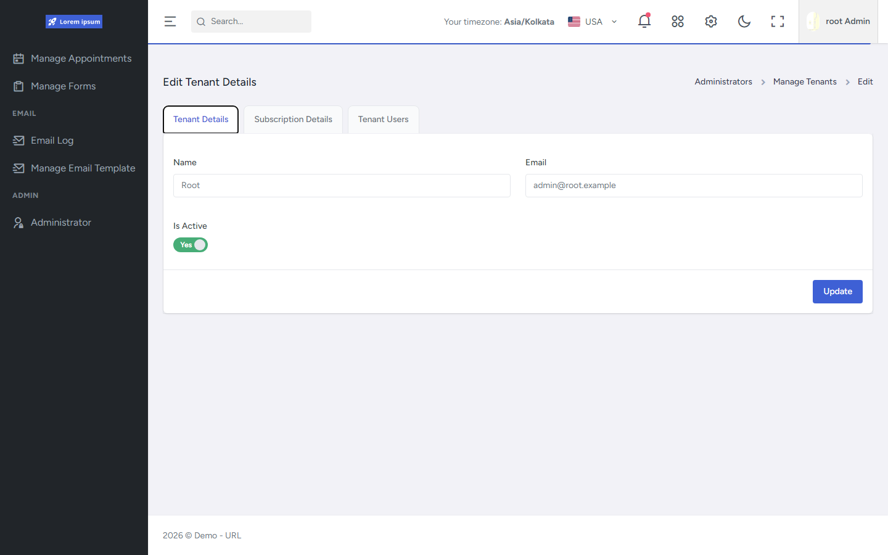
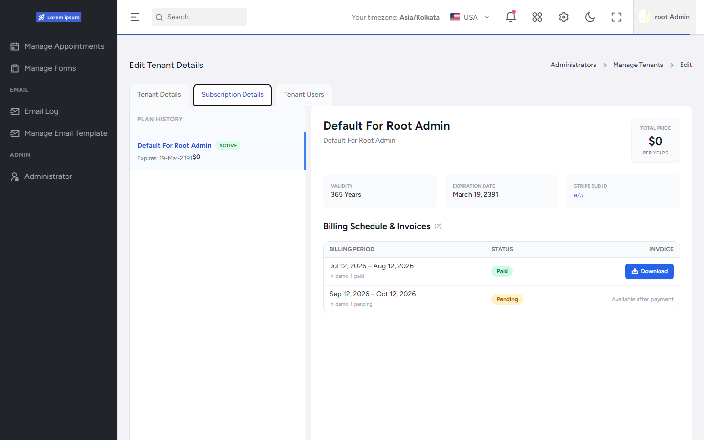
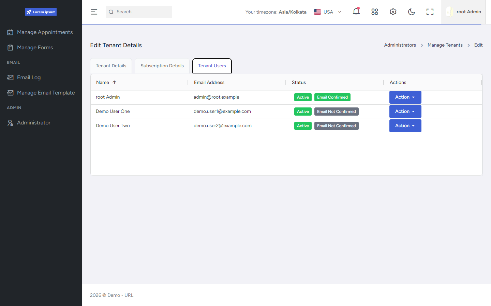

# Edit Tenant (tabs)

Edit Tenant Details for tenant id `1` (Root), showing all three tabs.

## Tenant Details

Name, email, and Is Active toggle with Update.

## Subscription Details

Plan history, plan overview, and billing schedule / invoices (demo Paid / Pending rows with `in_demo_*` ids — not live Stripe invoices).

## Tenant Users

Users belonging to the tenant with Active / email-confirmation badges. Non-demo emails were sanitized for public capture (`*.example.com`).

## Capability demonstrated

Root tenant inspection across profile, subscription/invoice surfaces, and tenant user list — the same edit landing used for other tenants.

## Evidence

- `FrontEnd/src/pages/orbit/manage-tenants/Components/EditTenantLandingPage.tsx`
- `FrontEnd/src/pages/orbit/manage-tenants/Components/EditTenantDetails.tsx`
- `FrontEnd/src/pages/orbit/manage-tenants/Components/ViewTenantSubscriptions.tsx`
- `FrontEnd/src/pages/orbit/manage-tenants/Components/ViewTenantUsers.tsx`
- `API/src/Host/Controllers/MultiTenant/MultiTenantController.cs`

## Related documentation

- [FrontEnd Tenant Administration](../../../FrontEnd/Tenant-Administration/README.md)
- [API Platform Foundation](../../../API/Platform-Foundation/README.md)
