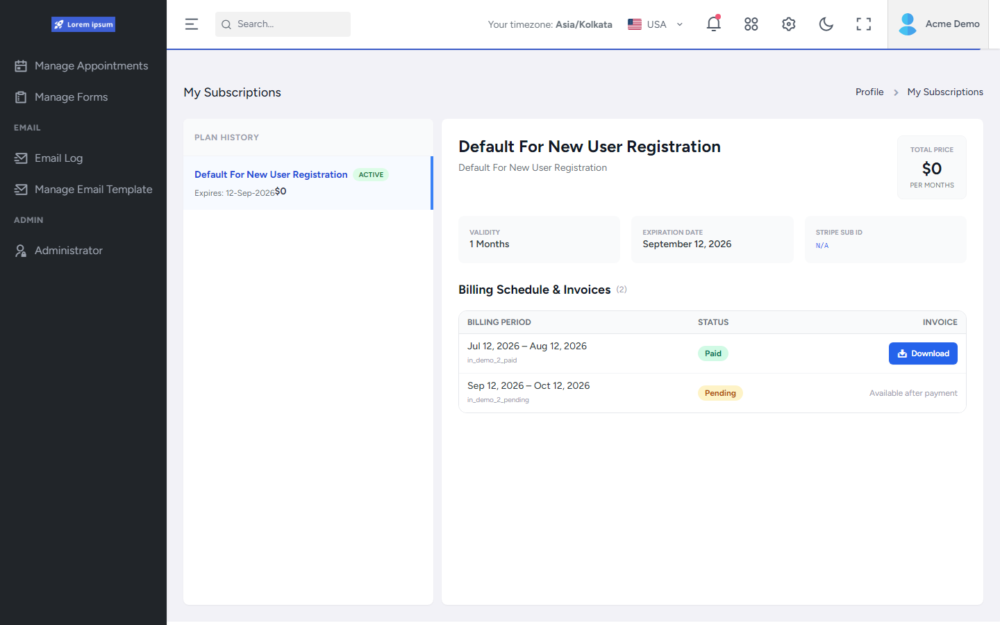

# My Subscriptions

## What this shows

Tenant-facing **My Subscriptions** view: plan history, plan overview (validity / expiration / Stripe sub id), and billing schedule with Paid / Pending demo invoices.

Captured while signed in as a **demo tenant** admin (`Acme Demo`) so the current-tenant subscription path is visible.

Invoice ids shown (`in_demo_*`) are local demo markers, not live Stripe objects.

## Capability demonstrated

Subscription visibility for the signed-in tenant (shared UI components with Root tenant subscription inspection).

## Evidence

- `FrontEnd/src/pages/orbit/my-subscriptions/`
- `FrontEnd/src/pages/orbit/manage-tenants/Components/ViewTenantSubscriptions.tsx`
- `API/src/Host/Controllers/MultiTenant/MultiTenantController.cs` (`get-tenant-subscriptions`)

## Related documentation

- [API Platform Foundation](../../../API/Platform-Foundation/README.md)
- [API Integrations — Stripe](../../../API/Integrations/README.md)
